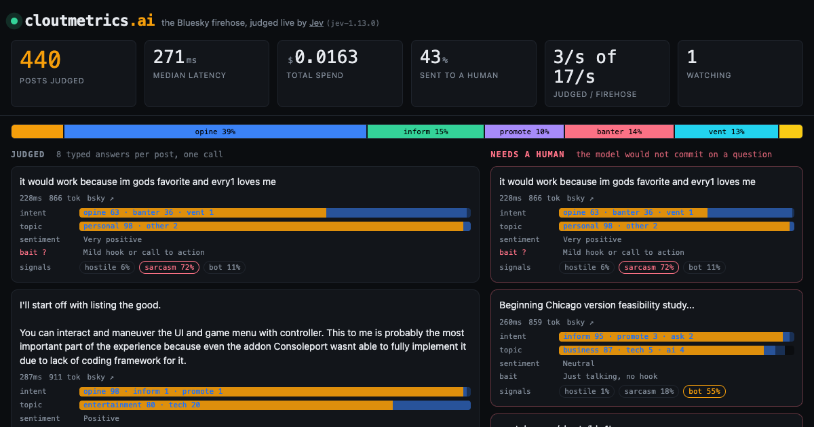

# firehose-judge

Put typed, calibrated judgment on a live stream. This repo watches the Bluesky
firehose and asks [Jev](https://typesafe.ai) eight questions about every
sampled post in a single call: intent, topic, sentiment, engagement bait,
hostility, sarcasm, bot-ness, and whether it is safe to put on a screen. The
answers come back as typed distributions with confidence, in a few hundred
milliseconds, for about three thousandths of a cent per post.

Live at [cloutmetrics.ai](https://cloutmetrics.ai).



The interesting part is not that a model can label posts. It is that this one
says how sure it is, and the page routes on that: anything the model would not
commit to slides into a second lane labelled "needs a human". You can watch it
be certain about spam and hesitate over sarcasm.

## How it works

```
Bluesky Jetstream ──ws──▶ Durable Object ──POST──▶ api.typesafe.ai
                          (one, named)   ◀─json──
                               │
                               └──ws broadcast──▶ every open browser tab
```

- One **Durable Object** holds the upstream websocket, samples posts with a
  token bucket, calls Jev, persists counters and a ring of recent posts in
  SQLite, and fans results out to viewers over hibernatable websockets.
- It only runs while someone is watching. When the last tab closes the
  heartbeat alarm drops the firehose connection, so an idle deploy costs
  nothing. Counters survive because they live in the DO's storage.
- One upstream stream regardless of viewer count, so a busy day cannot run up
  the bill.
- Posts Jev flags as unsafe are dropped server-side and counted, never sent to
  browsers.
- The frontend is one HTML file, one stylesheet, one script. No framework.

## Run it

```bash
npm install
echo 'TYPESAFE_API_KEY=...' > .dev.vars
npx wrangler dev
```

Open http://localhost:8787. Deploy with:

```bash
npx wrangler secret put TYPESAFE_API_KEY
npx wrangler deploy
```

That gives you a `*.workers.dev` URL. Add a custom domain in the Cloudflare
dashboard or via `routes` in `wrangler.jsonc` if you want one.

## Make it yours

Everything the model is asked lives in [`questions.json`](questions.json).
Change the questions and the page re-renders itself from the schema; choice
questions become probability bars, scores become meters, nouls become pills.
The only name the code cares about is `nsfw`, which drives the server-side
drop.

Knobs in `wrangler.jsonc`:

| var | default | what |
|---|---|---|
| `JUDGE_RATE_PER_SEC` | `3` | posts sent to Jev per second while viewers are connected |
| `MAX_INFLIGHT` | `8` | concurrent Jev calls |
| `JETSTREAM_URL` | us-east | any Jetstream instance, or any other websocket that emits posts |
| `TYPESAFE_MODEL` | `jev-latest` | pin a versioned id once you tune thresholds |
| `PRICE_PER_M_INPUT` | `0.042` | for the cost counter |

Review thresholds are in `src/jev.ts`. Scores are given a lower bar than
choices because a score that lands between two adjacent levels is a legitimate
answer, not indecision.

To point this at a different stream, replace `onPost` in `src/firehose.ts`
with a parser for your events. Everything downstream only needs a string of
text and an id.

## API

Everything is `GET`, CORS-open, and served by the Durable Object.

| endpoint | what |
|---|---|
| `/api/stats` | counters, cost, budget, funding, ad slots |
| `/api/panel` | everything the control panel renders, in one call |
| `/api/series?minutes=60` | per-minute means and intent mix |
| `/api/terms?minutes=60` | trending terms with burst scores |
| `/api/graph?minutes=60` | term co-occurrence nodes and edges |
| `/api/crosstab?rows=topic&cols=intent` | means per cell |
| `/api/votes` | human-vote calibration bins |
| `/api/curve?minutes=1440` | review share and human agreement at 21 confidence thresholds |
| `/api/posts?minutes=60&term=&intent=&topic=&limit=30` | recent judged posts, newest first |
| `/api/hourly?hours=720` | hourly rollups, kept forever |
| `/api/funding` | contributions and running cost by window |
| `/api/backers` | backer list, leaderboard, pinned message |
| `/api/archive` | keys of the nightly R2 dumps |
| `/api/export.ndjson?since=0&limit=5000` | raw judgments, one JSON object per line |
| `/api/alerts` | the surge log: term bursts, hostility spikes, mood swings |
| `/api/costs` | live Cloudflare usage priced for today, week, month (needs `CF_ANALYTICS_TOKEN`) |
| `/badge.svg` | shields-style badge of the three-minute mood |

`POST /api/stripe/webhook` takes Stripe events, verifies the `Stripe-Signature`
header against `STRIPE_WEBHOOK_SECRET`, and records contributions. Backer
messages go through the same eight questions as every post before they are
shown.

The judgment curve is the point of `/api/curve`: it replays the window at every
threshold from 0 to 1, so you can read what a stricter review bar would cost in
human hours and buy in agreement, then move `REVIEW_THRESHOLD` with evidence.

Nightly, the Durable Object writes the previous UTC day to R2 as
`judgments/YYYY-MM-DD.ndjson` and `hourly/YYYY-MM-DD.json`. Create the bucket
(`wrangler r2 bucket create cloutmetrics-archive`) or drop the `r2_buckets`
binding; without it the archive is skipped and nothing else changes.

More knobs in `wrangler.jsonc`:

| var | default | what |
|---|---|---|
| `MAX_USD_PER_DAY` | `5` | sampling stops when the rolling 24h spend hits this, and resumes when it drains |
| `INFRA_USD_PER_DAY` | `0.20` | flat Cloudflare estimate added to the running cost |
| `MONTHLY_GOAL_USD` | `150` | the funding meter's goal |
| `STRIPE_LINK` | empty | Payment Link shown to viewers; empty hides the ask |
| `ADSENSE_CLIENT`, `ADSENSE_SLOT` | empty | empty keeps AdSense off the page |

## What it costs

Measured on the live deploy: median latency ~260ms for eight questions, about
850 input tokens per post, output tokens free. At three posts a second that is
roughly $0.40 an hour of Jev while someone is watching, about $1.60 a day for
the idle trickle, and the Worker and
Durable Object stay inside Cloudflare's $5 plan.

## Tests and docs

`npm test` runs the vitest suite for term extraction, review thresholds, the
surge detector and the cost model. `docs/alerts.md` and `docs/costs.md` cover
the thresholds, the analytics token, and the exact GraphQL query.

## License

MIT.
